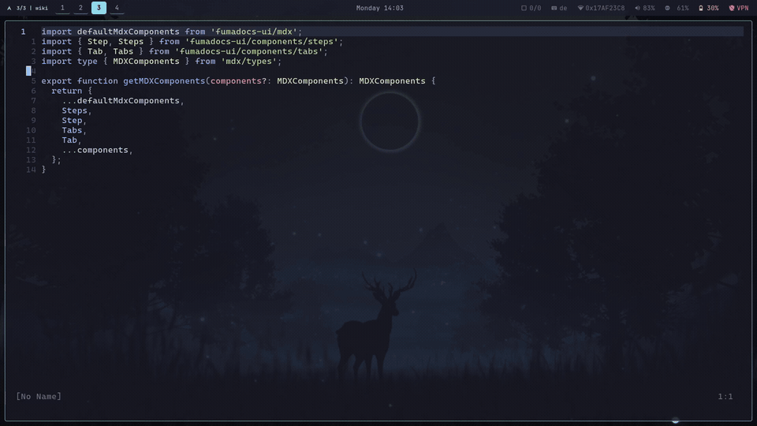
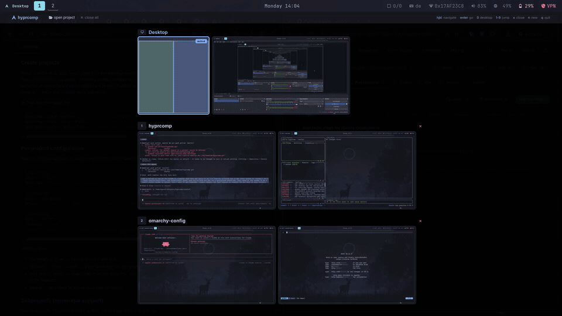
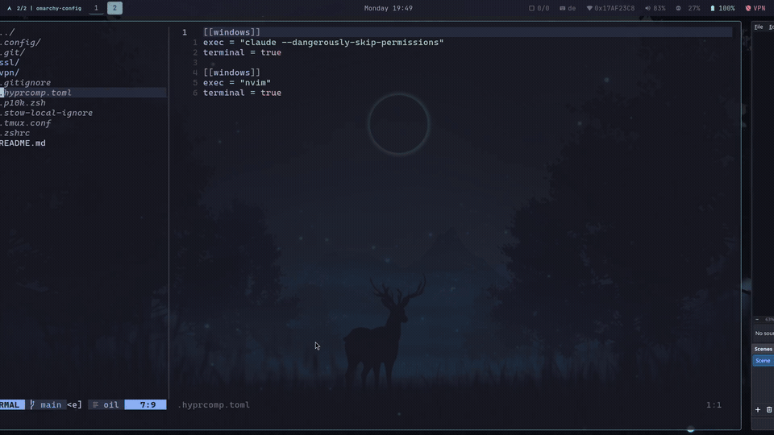
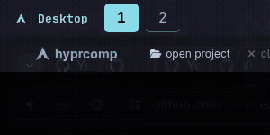

# HyprComp

**2D project-based workspace grid for Hyprland.** Each project gets its own row of workspaces -- swipe between projects vertically and between windows horizontally.



> [!NOTE]
> Inspired by [Theo's (t3.gg) post about "The Agentic Code Problem"](https://x.com/theo/status/2018091358251372601) ([video](https://www.youtube.com/watch?v=YVq28OTPCKw)) -- when working on multiple projects with AI coding agents, everything ends up split across terminal tabs, browser windows, and IDEs with no natural grouping. HyprComp gives each project its own isolated row of workspaces so everything stays together, including per-project Chromium instances with separate `--user-data-dir` for cookie/session isolation.

## How it works

Projects live in a 2D grid -- rows are projects, columns are windows within a project. A persistent Desktop row sits at the top for standalone apps.

```
               Col 1       Col 2       Col 3
Desktop        ws 1        ws 2        ws 3        (row 0)
Project A      ws 11       ws 12       ws 13       (row 1)
Project B      ws 21       ws 22       ws 23       (row 2)
Project C      ws 31       ws 32       ws 33       (row 3)
```

Up to **9 project rows** (1--9) with **10 workspaces** each, plus the Desktop row fixed at row 0. The `hyprcomp` script translates navigation into absolute workspace numbers via `hyprctl`, with directional animations -- `slide` horizontally, `slidevert` vertically. Navigation clamps to the highest occupied column so you never land on an empty workspace.

The overview is a GTK4 + layer-shell daemon that queries Hyprland's IPC socket directly (~2.5ms) and captures live screenshots via grim.

## Features

### Workspace overview

Fullscreen overlay with live thumbnails, active badges, and keyboard navigation. Runs as a background daemon listening on Hyprland's socket2 for real-time updates. Generates synthetic window previews when no screenshot is cached.

<video src="showcase/overview.mp4" controls muted loop></video>

### Gesture navigation

3-finger swipe left/right between windows, up/down between projects. Swiping past the last project opens the launcher.



### Desktop row

Persistent row for standalone apps (browser, Discord, etc.) -- always visible at the top of the overview, survives closing all projects.

<video src="showcase/desktop-row.mp4" controls muted loop></video>

### Project launcher

Walker-based menu (SUPER+N) that scans `~/projects/`, filters already-open projects and excluded directories, and supports recursive subproject navigation. Launches apps per `.hyprcomp.toml`.



### Quick close

Close the current project with a confirm dialog (SUPER+X) without opening the overview.

<video src="showcase/quick-close.mp4" controls muted loop></video>

### Waybar integration

Row-aware workspace buttons showing only the current project's workspaces, with a project name indicator (`1/4 | myproject`).



### Per-project app config

Define which apps to launch per project in `.hyprcomp.toml` -- terminal apps, isolated Chromium profiles, environment-based URLs.


## Keybindings

| Action                | Gesture              | Keybinding        |
| --------------------- | -------------------- | ----------------- |
| Switch window         | 3-finger swipe L/R   | `SUPER+1`--`0`    |
| Switch project        | 3-finger swipe U/D   | `SUPER+CTRL+UP/DOWN` |
| Move window to column |                      | `SUPER+SHIFT+1`--`0` |
| Workspace overview    |                      | `SUPER+Tab`       |
| Close project         |                      | `SUPER+X`         |
| New project           |                      | `SUPER+N`         |
| Restart overview      |                      | `SUPER+R`         |

<details>
<summary><strong>Overview shortcuts</strong></summary>

| Key             | Action                                            |
| --------------- | ------------------------------------------------- |
| `hjkl` / arrows | Navigate between workspaces                       |
| `Enter`         | Switch to selected workspace                      |
| `0` / backtick  | Jump to Desktop row                               |
| `1`--`9`        | Jump to Nth project                               |
| `d`             | Close hovered window                              |
| `a`             | Open new window in hovered project                |
| `n`             | Open project launcher                             |
| `x` / `Delete`  | Close hovered project (Desktop cannot be deleted) |
| `q` / `Escape`  | Close overlay                                     |

</details>

## Installation

> [!WARNING]
> Built on a live [Omarchy](https://omarchy.com) instance -- never tested as a fresh install. The guide below is best-effort. Contributions welcome.

### Dependencies

| Required | Optional |
| --- | --- |
| [Hyprland](https://hyprland.org), jq, [alacritty](https://alacritty.org), [walker](https://github.com/abenz1267/walker) | [waybar](https://github.com/Alexays/Waybar), Python 3.11+ w/ PyGObject & gtk4-layer-shell, [grim](https://sr.ht/~emersion/grim/) |

### Setup

```bash
git clone https://github.com/cellexec/hyprcomp ~/projects/hyprcomp
chmod +x ~/projects/hyprcomp/hyprcomp
```

**1. Hyprland keybindings** -- unbinds default SUPER+1-9 and replaces with project-relative navigation:

```bash
cp ~/projects/hyprcomp/config/hypr/hyprcomp.conf ~/.config/hypr/hyprcomp.conf
```
```ini
# ~/.config/hypr/hyprland.conf
source = ~/.config/hypr/hyprcomp.conf
```

**2. Gesture bindings** (requires [Hyprgrass](https://github.com/horriblename/hyprgrass)):

```bash
cp ~/projects/hyprcomp/config/hypr/gestures.conf ~/.config/hypr/gestures.conf
```
```ini
# ~/.config/hypr/hyprland.conf
source = ~/.config/hypr/gestures.conf
```

<details>
<summary>Or add gestures manually</summary>

```ini
gesture = 3, l, dispatcher, exec, ~/projects/hyprcomp/hyprcomp right
gesture = 3, r, dispatcher, exec, ~/projects/hyprcomp/hyprcomp left
gesture = 3, u, dispatcher, exec, ~/projects/hyprcomp/hyprcomp down
gesture = 3, d, dispatcher, exec, ~/projects/hyprcomp/hyprcomp up
```

</details>

**3. Waybar** (optional):

```bash
cp ~/projects/hyprcomp/config/waybar/scripts/project.sh ~/.config/waybar/scripts/
cp ~/projects/hyprcomp/config/waybar/scripts/ws-button.sh ~/.config/waybar/scripts/
```

Replace `"hyprland/workspaces"` in your waybar config with the modules from `config/waybar/hyprcomp-modules.jsonc` and add styles from `config/waybar/hyprcomp.css`.

**4. Overview daemon** (optional):

```ini
# ~/.config/hypr/hyprland.conf
exec-once = ~/projects/hyprcomp/hyprcomp-overview &
```

**5. Reload:**

```bash
hyprctl reload
killall waybar; waybar &disown
```

## Configuration

### Per-project apps

Place a `.hyprcomp.toml` in any project root:

```toml
[[windows]]
exec = "claude"
terminal = true     # Wrap in alacritty

[[windows]]
exec = "chromium"
browser = true      # Isolated --user-data-dir per project

[[windows]]
exec = "nvim"
terminal = true
# cwd = "subdir"    # Optional: working dir relative to project root
```

| Option | Effect |
| --- | --- |
| `terminal = true` | Launched in alacritty with zsh |
| `browser = true` | Gets `--user-data-dir` for per-project isolation |
| `url_env = "VAR"` | Reads URL from the project's `.env` file |
| _(none)_ | Launched as a plain GUI app |

### Excluding directories

Hide directories from the project launcher in `~/.config/hyprcomp/config.toml`:

```toml
exclude = ["__old", "archive"]
```

Matches by basename -- `__old` is skipped everywhere, including inside subprojects.

### Subprojects

For monorepos, define subprojects that appear as separate launcher entries:

```toml
[[subprojects]]
path = "flux"

[[subprojects]]
path = "monorepo/apps/web"
name = "monorepo-web"
```

Subprojects nest recursively.

### Config resolution

1. `<project_dir>/.hyprcomp.toml`
2. `~/.config/hyprcomp/defaults.toml`
3. Built-in defaults (claude, chromium, nvim)

## CLI reference

| Command | Description |
| --- | --- |
| `hyprcomp up\|down\|left\|right` | Navigate the grid |
| `hyprcomp go <col>` | Jump to column 1--10 |
| `hyprcomp move <col>` | Move window to column 1--10 |
| `hyprcomp create <name>` | Register a new project |
| `hyprcomp delete` | Delete current project |
| `hyprcomp delete-row <N>` | Delete a specific project row |
| `hyprcomp close` | Close current project (with confirm) |
| `hyprcomp rename <name>` | Rename current project |
| `hyprcomp reorder` | Compact row gaps after deletions |
| `hyprcomp list` | List all projects |
| `hyprcomp status` | Show current position |
| `hyprcomp overview` | Toggle workspace overview |
| `hyprcomp restart` | Restart overview daemon |

`hyprcomp-menu` is the standalone project launcher -- called by SUPER+N or when swiping past the last project.

## State files

| Path | Purpose |
| --- | --- |
| `~/.config/hyprcomp/state` | Current row number |
| `~/.config/hyprcomp/projects` | Row-to-name mapping |
| `~/.config/hyprcomp/config.toml` | Exclude list, global settings |
| `~/.config/hyprcomp/defaults.toml` | Default windows config |
| `~/.config/hyprcomp/chromium/<name>/` | Isolated Chromium profiles |
| `~/.cache/hyprcomp/thumbs/` | Workspace screenshot cache |

<details>
<summary><strong>Uninstalling</strong></summary>

1. Remove `source = ~/.config/hypr/hyprcomp.conf` from `hyprland.conf`
2. Restore default workspace gestures
3. Restore `"hyprland/workspaces"` in waybar config
4. `hyprctl reload && killall waybar && waybar &disown`
5. Remove `~/.config/hyprcomp/` and `~/.config/hypr/hyprcomp.conf`

</details>

## License

MIT
